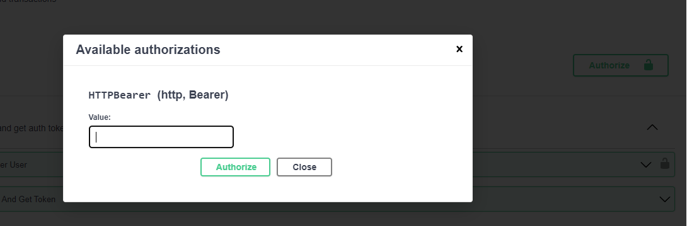
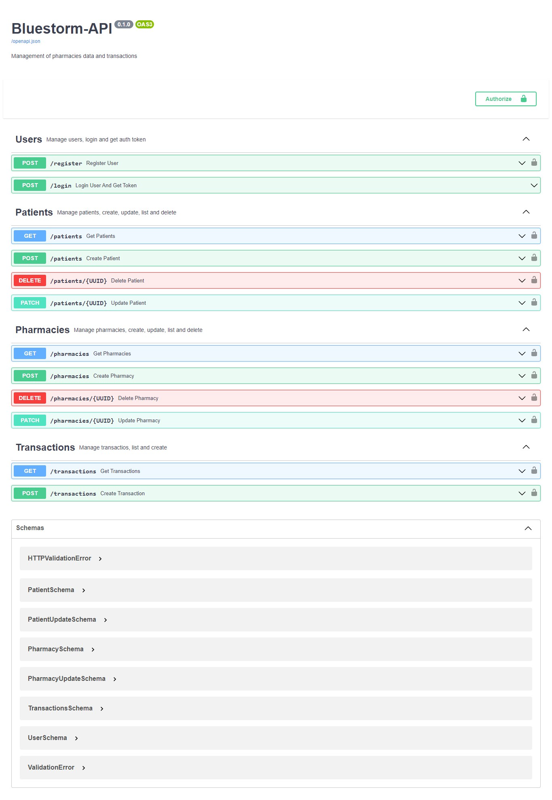

# Bluestorm API (FASTAPI) 🚀

# Manage patients and pharmacies transactions data

# Getting Started

First clone the repository from Github and switch to the new directory:

    $ git clone https://github.com/ffmatheus/bluestorm-api.git
    $ cd bluestorm-api
    
Install docker and docker-compose:

    https://docs.docker.com/desktop/install/windows-install/
    https://docs.docker.com/compose/

With Docker Desktop opened, run:

    $ docker-compose up --build
    
To run tests, run: 

    $ docker-compose exec api pytest
    
    
With docker-compose running and application builded, you can access the swagger by localhost link:

    http://localhost:8000/docs

To run endpoints, you need first make the login in /login endpoint. The superuser is:

    USERNAME: matheus
    PASSWORD: teste

You will receive a JWT token and can put that on Authorize

Now you can access all endpoints.

Enjoy ! 

# First look

